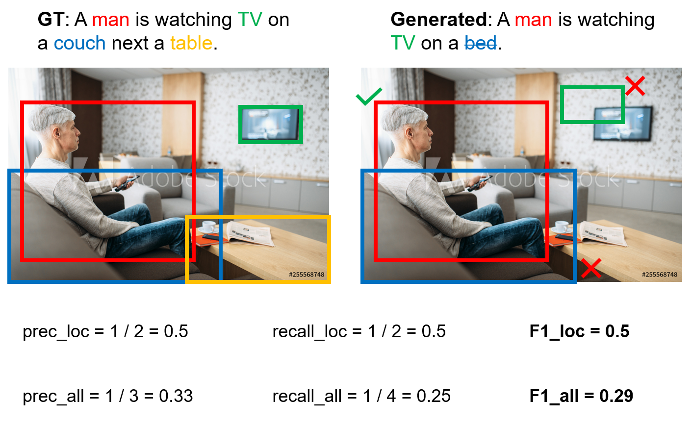

# ActivityNet Entities Dataset and Challenge 2020

### [ActivityNet Entities Object Localization (Grounding) Challenge](http://activity-net.org/challenges/2020/tasks/guest_anet_eol.html) joins the official [ActivityNet Challenge](http://activity-net.org/challenges/2020/challenge.html) as a guest task this year! See [below](#aeol) for details.

This repo hosts the dataset and evaluation scripts used in our paper [Grounded Video Description](https://arxiv.org/abs/1812.06587) (GVD). **We also released the source code of GVD in this [repo](https://github.com/facebookresearch/grounded-video-description).**

ActivityNet-Entities, is based on the video description dataset [ActivityNet Captions](https://cs.stanford.edu/people/ranjaykrishna/densevid/) and augments it with 158k bounding box annotations, each grounding a noun phrase (NP). Here we release the complete set of NP-based annotations as well as the pre-processed object-based annotations.


## <a name="aeol"></a>ActivityNet Entities Object Localization Challenge 2020
**The winners will be announced at ActivityNet Challenge at CVPR 2020 (June 14th). Prizes are to be decided.**

(A simplified version of the info below could be found in the ANet-Entities challenge [page](http://activity-net.org/challenges/2020/tasks/guest_anet_eol.html))

### Important dates
Note that these dates are tentative and subject to changes if necessary.
- March 2: Public Train/Val/Test sets are available; participants can start training.
- April 13: Release Hidden Test set with ground truth withheld and open evaluation server.
- May 22: Public the leaderboard.
- May 29: Close evaluation server.
- June 2: Deadline for submitting the report.
- June 14: A full-day workshop at CVPR 2020.

### Challenge overview
ActivityNet-Entities Object Localization Task aims to evaluate how grounded or faithful a description (could be generated or ground-truth) is to the video they describe.

An object word is first identified in the description and then localized in the video in the form of a spatial bounding box. The prediction is compared against the human annotation to determine the correctness and overall localization accuracy.

### Dataset overview
ActivityNet-Entities is based on the video description dataset ActivityNet Captions and augments it with 158k bounding box annotations, each grounding a noun phrase (NP). In this challenge, we will use pre-processed object-based annotations that link individual object words to their corresponding regions in the video. This gives 432 unique object categories.

The original dataset consists of 10k/2.5k/2.5k videos for training/validation/testing. There are 35k/8.6k/8.5k event segments & sentence descriptions and 105k/26.5k/26.1k bounding box annotations on each split. We have further collected a new **hidden** test set where the video descriptions are not public. This enables us to evaluate both video description quality and object localization quality.

The annotation on the training and validation set is in `data/anet_entities_cleaned_class_thresh50_trainval.json`. `data/anet_entities_skeleton.txt` specifies the JSON file structure on both reference files and submission files.

Depending on the availability of the video description during inference, we divide the challenge into two sub-tasks:

**Sub-task I**: Grounding on **GT** Sentences (public test set). The same data as in the Activity-Entities test set, which comes from ActivityNet Captions val set. The skeleton of the file is in `data/anet_entities_cleaned_class_thresh50_test_skeleton.json`, where we intentionally leave out the bounding box annotation for official evaluation purposes. GT sentences are provided.

**Sub-task II**: Grounding on **Generated** Sentences (**hidden** test set). GT sentences are NOT provided and hence both user sentence prediction and grounding prediction are required for evaluation. The skeleton of the file is in `data/anet_entities_cleaned_class_thresh50_hidden_test_skeleton.json`, where no video description nor bounding box is provided.

Regarding the format of the bounding box annotation, we first uniformly sample 10 frames from each event segment and sparsely locate objects from the description in only one of the frames where the object can be clearly observed.

### Pre-extracted features
For train/val/public test splits: [region features](https://dl.fbaipublicfiles.com/ActivityNet-Entities/ActivityNet-Entities/fc6_feat_100rois.tar.gz), [region coordinates](https://dl.fbaipublicfiles.com/ActivityNet-Entities/ActivityNet-Entities/anet_detection_vg_fc6_feat_100rois.h5).

For the **hidden** test split: TBD [region features](), [region coordinates]().

Note that the feature files are saved as individual *.npy files for legacy reasons.

The pre-extracted frames (10 per segment) are available on request. Please email [Luowei](mailto:luozhou@umich.edu) for details.

### Evaluation metrics
Due to the sparsity of the annotation, we request all participants to submit the localization results on all object categories appearing in the target sentence on all 10 sampled frames. Only the prediction at the same frame as the GT annotation will be assessed and compared against the human annotation to determine the correctness (>50% IoU indicates correct and otherwise incorrect). Localization accuracy is computed per object category and then averaged by the number of unique object categories.

The evaluation metric used in Sub-task I is Localization Accuracy (with 50% IoU threshold). We have benchmarked the baseline methods below (averaged over three runs).

| **Method** | **Localization Accuracy** |
|-----|-----------------------|
| GVD | 43.45% |

The evaluation metrics used in Sub-task II include F1\_all, F1\_loc, F1\_all\_per\_sent, and F1\_loc\_per\_sent (all with 50% IoU threshold). We have benchmarked the baseline methods below (averaged over three runs).

| **Method** | **F1\_all\_per\_sent** | F1\_loc\_per\_sent | F1\_all | F1\_loc |
|-----|-----------------|-----------------|--------|--------|
| GVD | **17.26%** | 58.57% | 7.46% | 22.88% |

(Important!) F1\_all, and F1\_loc are proposed as the official metrics in [Zhou et al. CVPR 2019](https://arxiv.org/pdf/1812.06587.pdf). In F1\_all, a region prediction is considered correct if the object word is correctly predicted and also correctly localized. In F1\_loc, we only consider correctly-predicted object words, i.e., language generation error (e.g., hallucinated objects) is ignored. However, as both metrics average accuracies over object categories, they emphasize unproportionally on description diversity, as object classes never predicted will have zero accuracy and reduce overall metric numbers. In fact, in the baseline method GVD, only about half of the object categories are predicted (that’s why we see a low F1\_all score). Hacks such as increasing accuracies on the long-tail classes will significantly improve the metric scores which is not exactly the purpose of the challenge. **Therefore, we propose two more metrics for this sub-task, F1\_all\_per\_sent  and F1\_loc\_per\_sent, where the accuracies are averaged over all the sentences.** Note that none of the four metrics are perfect, but at least give us a holistic view of the system performance. More details on evaluation metrics are in Sec. 5.1 and A.2 in [Zhou et al. CVPR 2019](https://arxiv.org/pdf/1812.06587.pdf). The evaluation script (same as in the evaluation server) is available at https://github.com/facebookresearch/ActivityNet-Entities#evaluation.

**To determine the winner, we adopt the highest score on Localization Accuracy on Sub-task I and the highest score on F1\_all\_per\_sent on Sub-task II.**

A visual demonstration of F1\_all and F1\_loc is shown below. The evaluation script used in our evaluation server will be identical to `scripts/eval_grd_anet_entities.py`. Read the following [section](#eval) for more details.



### Evaluation servers
For Sub-task I - GT Captions: https://competitions.codalab.org/competitions/20537

For Sub-task II - Generated Captions: TBD

Please follow the example in `data/anet_entities_skeleton.txt` to format your submission file.

## General Dataset Info
### Data
We have the following dataset files under the `data` directory:

- `anet_entities_skeleton.txt`: Specify the expected structure of the JSON annotation files.
- `anet_entities_cleaned_class_thresh50_trainval.json`: Pre-processed dataset file with object class and bounding box annotations. For training and validation splits only.
- `anet_entities_cleaned_class_thresh50_test_skeleton.json`: Object class annotation for the public testing split. This file is for evaluation server purpose and no bounding box annotation is given.
- `anet_entities_cleaned_class_thresh50_hidden_test_skeleton.json`: Object class annotation for the **hidden** testing split. This file is for evaluation server purpose and no description nor bounding box annotation is given.
- `anet_entities_trainval.json`: The raw dataset file with noun phrase and bounding box annotations. We only release the training and the validation splits for now.
- `split_ids_anet_entities.json`: Video IDs included in the training/validation/public testing/**hidden** testing splits.

Note: Both the raw dataset file and the pre-processed dataset file contain all the 12469 videos in our training and validation split (training + one half of the validation split as in ActivityNet Captions, which is based on [ActivityNet 1.3](http://activity-net.org/download.html)). This includes 626 videos without box annotations.

###  <a name="eval"></a>Evaluation
Under the `scripts` directory, we include:

- `eval_grd_anet_entities.py`: The evaluation script for object grounding on GT/generated captions. [PyTorch (tested on 1.1 and 1.3)](https://pytorch.org/get-started/locally/), [Stanford CoreNLP 3.9.1](https://stanfordnlp.github.io/CoreNLP/history.html) and the [Python wrapper](https://github.com/Lynten/stanford-corenlp) are required.
- `attr_prep_tag_NP.py`: The preprocessing scripts to obtain the NP/object annotation files.
- `anet_entities_np_stats.py`, `anet_entities_object_stats.py`: The scripts that print the dataset stats.

To evaluate attention/grounding output based upon GT sentences (metrics in paper: Attn., Grd.), run:
```
python scripts/eval_grd_anet_entities.py -s YOUR_SUBMISSION_FILE.JSON --eval_mode GT
```

To evaluate attention (same for grounding) output based upon generated sentences (metrics in paper: F1<sub>all</sub>, F1<sub>loc</sub>), similarly run:
```
python scripts/eval_grd_anet_entities.py -s YOUR_SUBMISSION_FILE.JSON --eval_mode gen --loc_mode $loc_mode
```
where setting `loc_mode=all` to perform evaluation on all object words while setting `loc_mode=loc` to perform evaluation only on correctly-predicted object words.

### FAQs
1. How are the 10 frames sampled from each video clip (event)?

   We divide each clip evenly into 10 segments and sample the middle frame of each segment. We have clarified this in the skeleton [file](https://github.com/facebookresearch/ActivityNet-Entities/blob/master/data/anet_entities_skeleton.txt#L13).

2. How can I sample the frames by myself and extract feature?

   First, you may want to check if the object region feature and RGB/motion frame-wise feature we [provided](https://github.com/facebookresearch/grounded-video-description#data-preparation) meet your requirement.
   If not, you can first download the ActivityNet videos using this [web crawler](https://github.com/activitynet/ActivityNet/blob/master/Crawler/fetch_activitynet_videos.sh) or contact the dataset [owners](http://activity-net.org/people.html) for help. An incorrect video encoding format would result in a wrong frame resolution and aspect ratio, and therefore a mismatch in the annotation. Hence, make sure you download the videos in the [best mp4 format](https://github.com/activitynet/ActivityNet/blob/master/Crawler/run_crosscheck.py#L32). Note that the web crawler is not appliable to the **hidden** test set as its video IDs are not YouTube IDs. Contact [Luowei](mailto:luozhou@umich.edu) to get these videos.
   Once you have the videos, you can use `ffmpeg` to extract the frames. We provide an example command [here](https://github.com/facebookresearch/ActivityNet-Entities/issues/1#issuecomment-529065386).

### Reference
Please contact <luozhou@umich.edu> if you have any trouble running the code. Please cite the following paper if you use the dataset.
```
@inproceedings{zhou2019grounded,
  title={Grounded Video Description},
  author={Zhou, Luowei and Kalantidis, Yannis and Chen, Xinlei and Corso, Jason J and Rohrbach, Marcus},
  booktitle={CVPR},
  year={2019}
}
```

### Acknowledgement
We thank Chih-Yao Ma for his helpful discussions and contribution to the code on evaluation metrics.

### License
This project is licensed under the license found in the LICENSE file in the root directory of this source tree.

The noun phrases in these annotations are based on [ActivityNet Captions](https://cs.stanford.edu/people/ranjaykrishna/densevid/), which are linked to videos in [ActivityNet 1.3](http://activity-net.org/download.html) 
